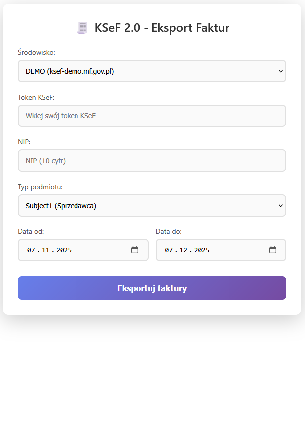
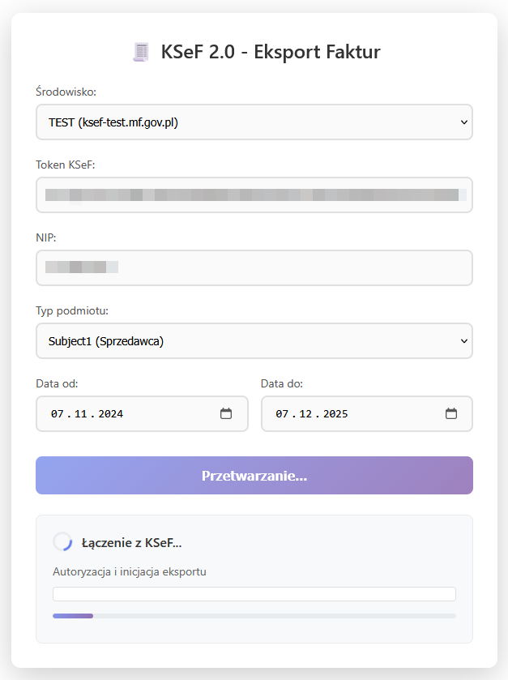
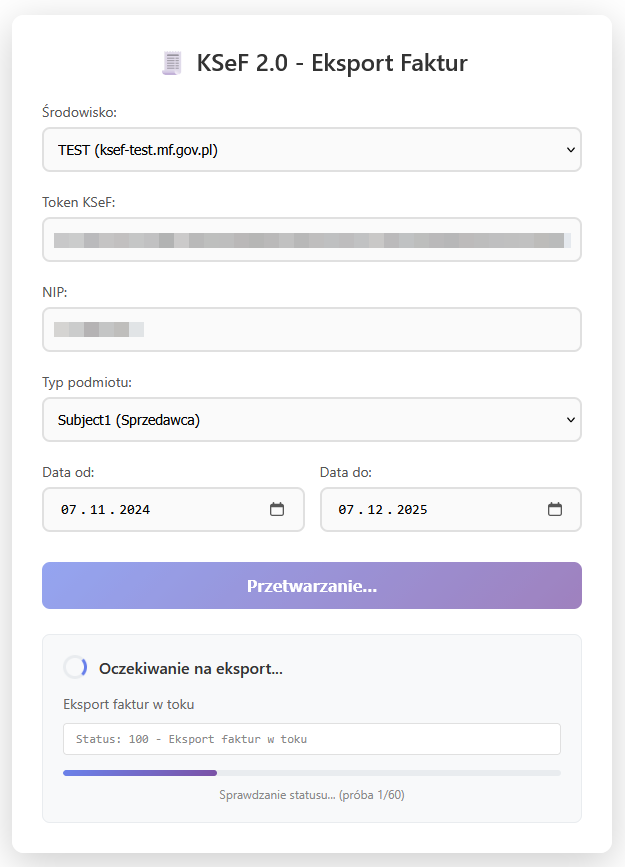
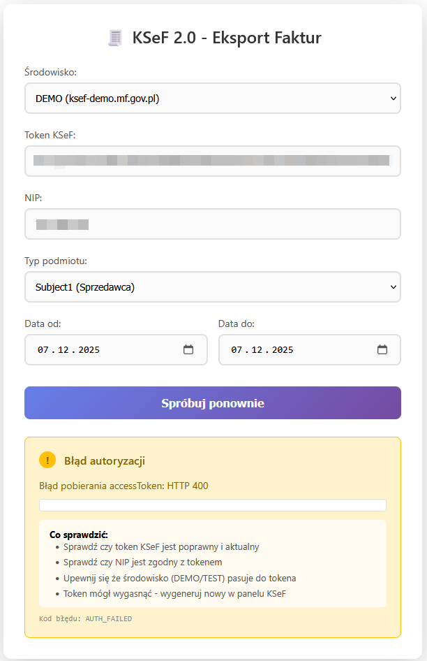

<h1 align="center">KSeF Export</h1>

<p align="center">
  <strong>Eksportuj faktury z Krajowego Systemu e-Faktur w kilka kliknięć</strong>
</p>

<p align="center">
  <a href="#-funkcje">Funkcje</a> •
  <a href="#-quick-start">Quick Start</a> •
  <a href="#%EF%B8%8F-instalacja">Instalacja</a> •
  <a href="#-dokumentacja">Dokumentacja</a> •
  <a href="#-licencja">Licencja</a>
</p>

<p align="center">
  
  
  
</p>

---

## 📸 Podgląd

<p align="center">
  
  
</p>

<details>
<summary>🖼️ Więcej screenów</summary>

| Ładowanie | Oczekiwanie | Błąd |
|:---------:|:-----------:|:----:|
|  |  |  |

</details>

---

## ✨ Funkcje

- 🚀 **Prosty interfejs** - eksport faktur w 3 krokach
- 🔄 **Automatyczne odpytywanie** - nie musisz odświeżać strony
- 🔐 **Bezpieczna autoryzacja** - szyfrowanie RSA-OAEP + AES-256
- 📦 **Pobieranie ZIP** - faktury pobierane bezpośrednio do przeglądarki
- ⚠️ **Inteligentne błędy** - jasne komunikaty co poszło nie tak
- 📋 **Logowanie** - pełna historia operacji API

---

## 🚀 Quick Start

```bash
# 1. Sklonuj repozytorium
git clone https://github.com/poulCuzz/ksef-export.git

# 2. Zainstaluj zależności
cd ksef-export
composer install

# 3. Pobierz certyfikaty KSeF (instrukcja poniżej)

# 4. Uruchom serwer
php -S localhost:8000

# 5. Otwórz http://localhost:8000
```

---

## 🛠️ Instalacja

### Wymagania

- PHP 8.0 lub nowszy
- Rozszerzenia PHP: `curl`, `openssl`, `json`
- Composer
- Token KSeF (wygenerowany w panelu Ministerstwa Finansów)

### Krok 1: Pobierz projekt

```bash
git clone https://github.com/poulCuzz/ksef-export.git
cd ksef-export
```

### Krok 2: Zainstaluj zależności

```bash
composer install
```

### Krok 3: Pobierz certyfikaty KSeF

Pobierz certyfikaty z oficjalnej strony KSeF:

**Środowisko DEMO:**
```
https://ksef-demo.mf.gov.pl/api/security/public-key-certificates
```

**Środowisko TEST:**
```
https://ksef-test.mf.gov.pl/api/security/public-key-certificates
```

Zapisz certyfikaty:
- `auth/public_key.pem` - certyfikat do autoryzacji
- `export/public_key_symetric_encription.pem` - certyfikat do szyfrowania eksportu

### Krok 4: Utwórz wymagane katalogi

```bash
mkdir -p logs temp
chmod 777 logs temp
```

### Krok 5: Uruchom

**Opcja A: Wbudowany serwer PHP (development)**
```bash
php -S localhost:8000
```

**Opcja B: Apache/Nginx (production)**

Skonfiguruj virtual host wskazujący na katalog projektu.

---

## 📖 Dokumentacja

### Jak uzyskać Token KSeF?

1. Wejdź na [ksef-demo.mf.gov.pl](https://ksef-demo.mf.gov.pl) (DEMO) lub [ksef-test.mf.gov.pl](https://ksef-test.mf.gov.pl) (TEST)
2. Zaloguj się przez profil zaufany lub certyfikat
3. Przejdź do **Tokeny** → **Generuj nowy token**
4. Skopiuj wygenerowany token

> ⚠️ **Ważne:** Token z DEMO działa tylko na środowisku DEMO. Token z TEST tylko na TEST.

### Struktura projektu

```
ksef-export/
├── index.php              # Frontend - formularz
├── api.php                # Backend - API endpoints
├── logger.php             # System logowania
├── composer.json          # Zależności PHP
├── auth/
│   └── public_key.pem     # Certyfikat autoryzacji
├── export/
│   └── public_key_symetric_encription.pem  # Certyfikat szyfrowania
├── logs/
│   └── ksef_api_log.json  # Logi operacji (tworzony automatycznie)
├── temp/
│   └── session_*.json     # Sesje tymczasowe (tworzone automatycznie)
└── docs/
    └── images/            # Screenshoty
```

### API Endpoints

| Endpoint | Metoda | Opis |
|----------|--------|------|
| `api.php?action=start_export` | POST | Rozpoczyna eksport faktur |
| `api.php?action=check_status&session=XXX` | GET | Sprawdza status eksportu |
| `api.php?action=download&session=XXX&part=0` | GET | Pobiera plik ZIP |

### Parametry eksportu

| Parametr | Opis | Przykład |
|----------|------|----------|
| `env` | Środowisko (demo/test) | `demo` |
| `ksef_token` | Token autoryzacyjny | `20251124-EC-...` |
| `nip` | NIP firmy (10 cyfr) | `1234567890` |
| `subject_type` | Typ podmiotu | `Subject1` (sprzedawca) / `Subject2` (nabywca) |
| `date_from` | Data od | `2024-01-01` |
| `date_to` | Data do | `2024-12-31` |

---

## 🔒 Bezpieczeństwo

- Tokeny i klucze **nie są logowane w całości** (tylko pierwsze znaki)
- Sesje wygasają po **1 godzinie**
- Pliki ZIP są szyfrowane **AES-256-CBC** przez KSeF
- Komunikacja przez **HTTPS**

---

## 🐛 Rozwiązywanie problemów

### "Błąd autoryzacji"

- Sprawdź czy token jest poprawny
- Sprawdź czy NIP zgadza się z tokenem
- Sprawdź czy środowisko (DEMO/TEST) pasuje do tokena

### "Eksport nie jest jeszcze gotowy"

- To normalne na środowisku TEST - serwer przetwarza żądania w kolejce
- Aplikacja automatycznie odpytuje co 3 sekundy (max 3 minuty)

### "Błąd pobierania certyfikatu"

- Upewnij się że pliki `.pem` są w katalogach `auth/` i `export/`
- Sprawdź czy certyfikaty są aktualne

---

## 🤝 Współpraca

Znalazłeś błąd? Masz pomysł na funkcję?

1. Otwórz [Issue](https://github.com/poulCuzz/ksef-export/issues)
2. Lub stwórz Pull Request

---

## 📄 Licencja

Ten projekt jest dostępny na licencji MIT. Zobacz plik [LICENSE](LICENSE) po szczegóły.

---

## 👨‍💻 Autor

**poulCuzz** - [GitHub](https://github.com/poulCuzz)

---

<p align="center">
  <sub>Stworzone z ❤️ dla polskich przedsiębiorców</sub>
</p>
