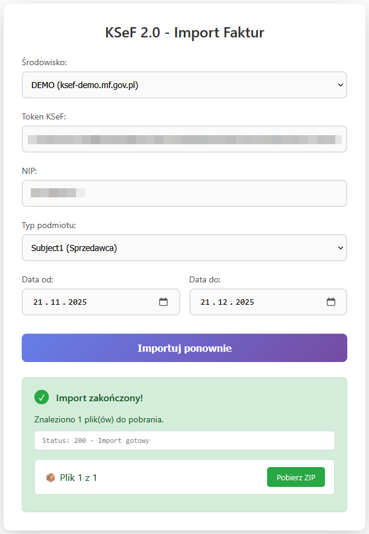

<h1 align="center">KSeF Import</h1>

<p align="center">
  <strong>Importowanie faktur z Krajowego Systemu e-Faktur w kilka kliknięć</strong>
</p>

<p align="center">
  <a href="#funkcje">Funkcje</a> •
  <a href="#quick-start">Quick Start</a> •
  <a href="#instalacja">Instalacja</a> •
  <a href="#dokumentacja">Dokumentacja</a>
</p>

---

## Podgląd

<p align="center">
  
</p>

---

## Funkcje

- **Prosty interfejs** - import faktur w 3 krokach
- **Automatyczne odpytywanie** - nie musisz odświeżać strony
- **Bezpieczna autoryzacja** - szyfrowanie RSA-OAEP + AES-256
- **Pobieranie ZIP** - faktury pobierane bezpośrednio do przeglądarki
- **Inteligentne błędy** - jasne komunikaty co poszło nie tak
- **Logowanie** - pełna historia operacji API

---

## Quick Start

```bash
# 1. Sklonuj repozytorium
git clone https://github.com/poulCuzz/ksef-import.git

# 2. Zainstaluj zależności
cd ksef-import
composer install

# 3. Uruchom serwer
php -S localhost:8000

# 4. Otwórz http://localhost:8000
```

---

## Instalacja

### Wymagania

- PHP 8.0 lub nowszy
- Rozszerzenia PHP: `curl`, `openssl`, `json`
- Composer
- Token KSeF (wygenerowany w panelu Ministerstwa Finansów) lub certyfikat (.cert + .key + hasło)

### Krok 1: Pobierz projekt

```bash
git clone https://github.com/poulCuzz/ksef-import.git
cd ksef-import
```

### Krok 2: Zainstaluj zależności

```bash
composer install
```

### Krok 3: Utwórz wymagane katalogi

```bash
mkdir -p logs temp
chmod 777 logs temp
```

### Krok 4: Uruchom

**Opcja A: Wbudowany serwer PHP (development)**
```bash
php -S localhost:8000
```

**Opcja B: Apache/Nginx (production)**

Skonfiguruj virtual host wskazujący na katalog projektu.

---

## Dokumentacja

### Jak uzyskać Token KSeF?

1. Wejdź na [ksef-demo.mf.gov.pl](https://ksef-demo.mf.gov.pl) (DEMO) lub [ksef-test.mf.gov.pl](https://ksef-test.mf.gov.pl) (TEST)
2. Zaloguj się przez profil zaufany lub certyfikat
3. Przejdź do **Tokeny** → **Generuj nowy token**
4. Skopiuj wygenerowany token

> **Ważne:** Token z DEMO działa tylko na środowisku DEMO. Token z TEST tylko na TEST.

### Struktura projektu

```
ksef-import/

│   .gitignore
│   api.php
│   app.js
│   composer.json
│   composer.lock
│   do_poprawy.txt
│   index.html
│   LICENSE
│   README.md
│   styles.css
│
├───docs
│   └───images
│           screenshot-success.png
│
├───logs
│       .gitkeep
│
├───src
│   │   KsefService.php
│   │
│   ├───Api
│   │   │   ErrorHandler.php
│   │   │   Helpers.php
│   │   │
│   │   └───Actions
│   │           CheckStatusAction.php
│   │           DownloadAction.php
│   │           StartExportAction.php
│   │           StartImportWithCertificateAction.php
│   │
│   ├───Auth
│   │   │   .gitkeep
│   │   │   AuthenticatorInterface.php
│   │   │   CertificateAuthenticator.php
│   │   │   KsefAuthenticator.php
│   │   │   TokenEncryptor.php
│   │   │
│   │   └───keys_cache
│   │           token_key_demo.pem
│   │
│   ├───Export
│   │   │   .gitkeep
│   │   │   EncryptionHandler.php
│   │   │   ExporterInterface.php
│   │   │   FileDecryptor.php
│   │   │   KsefExporter.php
│   │   │   last_export_encryption.json
│   │   │
│   │   └───keys_cache
│   │           public_key_demo.pem
│   │           public_key_prod.pem
│   │
│   ├───Http
│   │       KsefClient.php
│   │
│   └───Logger
│           JsonLogger.php
│           LoggerInterface.php
│
└───temp
        .gitkeep
        .htaccess
```

### API Endpoints

| Endpoint | Metoda | Opis |
|----------|--------|------|
| `api.php?action=start_import` | POST | Rozpoczyna import faktur (autoryzacja tokenem) |
| `api.php?action=start_import_certificate` | POST | Rozpoczyna import faktur (autoryzacja certyfikatem XAdES) |
| `api.php?action=check_status` | GET | Sprawdza status importu |
| `api.php?action=download` | GET | Pobiera zaszyfrowany plik ZIP |

### Parametry importu (z perspektywy KSeF API eksportu)

| Parametr | Opis | Przykład |
|----------|------|----------|
| `env` | Środowisko (demo/test/prod) | `demo` |
| `ksef_token` | Token autoryzacyjny | `20251124-EC-...` |
| `nip` | NIP firmy (10 cyfr) | `1234567890` |
| `subject_type` | Typ podmiotu | `Subject1` (sprzedawca) / `Subject2` (nabywca) |
| `date_from` | Data od | `2024-01-01` |
| `date_to` | Data do | `2024-12-31` |

---

## Rozwiązywanie problemów

### "Błąd autoryzacji"

- Sprawdź czy token jest poprawny
- Sprawdź czy NIP zgadza się z tokenem
- Sprawdź czy środowisko (DEMO/TEST/PROD) pasuje do tokena/ certyfikatu

---

## Autor

**poulCuzz** - [GitHub](https://github.com/poulCuzz)  
☕ Jeśli chcesz podziękować kawą: BLIK 603115866


